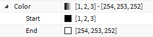
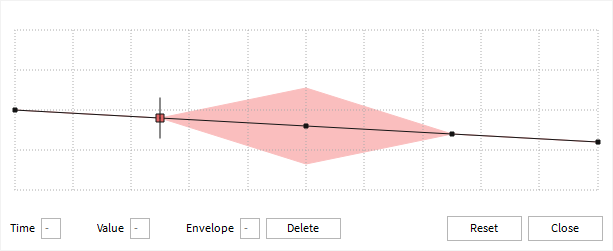
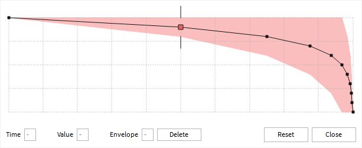

# Steps

1. Open a new place.
2. Insert [`particle.rbxmx`](particle.rbxmx).
3. Observe the following properties. If the bug occurs, their values should be
   the defaults, and *not* the values displayed in the images.

**Color:**

**Size:**

**Transparency:**

